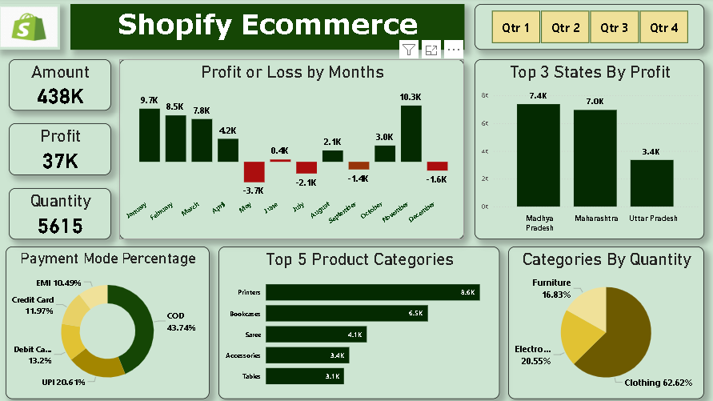

# 🛍️ Shopify Ecommerce Power BI Dashboard

### 📊 Project Overview

This Power BI dashboard provides a complete analysis of Shopify Ecommerce performance, including **sales amount, profit, quantity, product categories, payment modes, and state-wise profits**.
The dashboard helps in understanding business growth, identifying profitable regions, and analyzing sales trends month by month.

---

### 💡 Key Insights

* **Total Amount:** ₹438K
* **Total Profit:** ₹37K
* **Total Quantity Sold:** 5615 units
* **Highest Profit Month:** November (₹10.3K)
* **Top 3 States by Profit:**

  * Madhya Pradesh
  * Maharashtra
  * Uttar Pradesh
* **Most Popular Category by Quantity:** Clothing (62.62%)
* **Top Payment Mode:** Cash on Delivery (43.74%)

---

### 📈 Dashboard Features

* Monthly Profit and Loss Visualization
* Top States by Profit
* Product Category and Quantity Analysis
* Payment Mode Distribution (Pie Chart)
* Top 5 Product Categories by Profit
* Quarter-wise Filter Buttons

---

### 🛠️ Tools & Technologies Used

* **Power BI** – Data Visualization
* **Excel / CSV** – Data Source
* **Shopify Sales Dataset** – Sample Dataset

---

### 📷 Dashboard Preview

---

### 🎯 Purpose

The main goal of this dashboard is to **analyze ecommerce performance** and help businesses make data-driven decisions regarding product sales, customer preferences, and regional profits.

---

### 🧑‍💻 Created By

**Aryan Bataviya**
*Data Analyst | Power BI Enthusiast*

